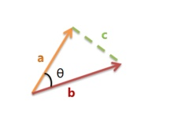
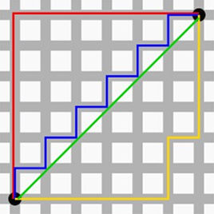

# 一.基于用户的协同过滤算法简介
在推荐系统的众多方法之中，基于用户的协同过滤是诞最早的，原理也比较简单。基于协同过滤的推荐算法被广泛的运用在推荐系统中，比如影视推荐、猜你喜欢等、邮件过滤等。该算法1992年提出并用于邮件过滤系统，两年后1994年被 GroupLens 用于新闻过滤。一直到2000年，该算法都是推荐系统领域最著名的算法。

当用户A需要个性化推荐的时候，可以先找到和他兴趣详细的用户集群G，然后把G喜欢的并且A没有的物品推荐给A，这就是基于用户的协同过滤。

根据上述原理，我们可以将算法分为两个步骤：

 1. 找到与目标兴趣相似的用户集群
 2. 到这个集合中用户喜欢的、并且目标用户没有听说过的物品推荐给目标用户。

## 二、常用的相似度计算方法
下面，简单的举例几个机器学习中常用的样本相似性度量方法：

 - 欧式距离（Euclidean Distance）
 - 夹角余弦（Cosine）
 - 汉明距离（Hamming distance） 
 - 皮尔逊相关系数（Pearson）
 - 曼哈顿距离（Manhattan Distance）
 
### 1、 欧式距离（Euclidean Distance）
欧式距离全称是欧几里距离，是最易于理解的一种距离计算方式，源自欧式空间中两点间的距离公式。
平面空间内的  a(x1,y1) 与  b(x2,y2 ) 间的欧式距离：  

- 三维空间里的欧式距离：  

 

Python 代码简单实现：

    def EuclideanDistance(x,y):
        d = 0
        for a,b in zip(x,y):
            d += (a-b)**2
        return d**0.5

使用 numpy 简化：

    import numpy as np
    def EuclideanDistance(dataA,dataB):
        # np.linalg.norm 用于范数计算，默认是二范数，相当于平方和开根号
        return 1.0/(1.0 + np.linalg.norm(dataA - dataB))

### 2、夹角余弦（Cosine）
首先，样本数据的夹角余弦并不是真正几何意义上的夹角余弦，只不过是借了它的名字，实际是借用了它的概念变成了是代数意义上的“夹角余弦”，用来衡量样本向量间的差异。

几何意义上的夹角余弦

夹角越小，余弦值越接近于1，反之则趋于-1。我们假设有x1与x2两个向量：

Python 代码的简单按公式还原：

    def Cosine(x,y):
        sum_xy = 0.0;  
        normX = 0.0;  
        normY = 0.0;  
        for a,b in zip(x,y):  
            sum_xy += a*b  
            normX += a**2  
            normY += b**2  
        if normX == 0.0 or normY == 0.0:  
            return None  
        else:  
            return sum_xy / ((normX*normY)**0.5)  

使用 numpy 简化夹角余弦
  
    def Cosine(dataA,dataB):
        sumData = dataA *dataB.T # 若列为向量则为 dataA.T * dataB
        denom = np.linalg.norm(dataA) * np.linalg.norm(dataB)
        # 归一化
        return 0.5 + 0.5 * (sumData / denom)

 
我们引入一组特殊数据进行测试：

    dataA = np.mat([1,2,3,3,2,1])
    dataB = np.mat([2,3,4,4,3,2])
    print(EuclideanDistance(dataA,dataB)) # 0.28
    print(Cosine(dataA,dataB)) # 0.99

欧式距离和夹角余弦的区别：
对比以上的结果的 dataA 与 dataB 这两组数据，会发现 dataA 与 dataB 的欧式距离相似度比较小，而夹角余弦相似度比较大，即夹角余弦更能反映两者之间的变动趋势，两者有很高的变化趋势相似度，而欧式距离较大是因为两者数值有很大的区别，即两者拥有很高的数值差异。

### 3、汉明距离（Hamming distance）
汉明距离表示的是两个字符串（相同长度）对应位不同的数量。比如有两个等长的字符串 str1 = "11111" 和 str2 = "10001" 那么它们之间的汉明距离就是3（这样说就简单多了吧。哈哈）。汉明距离多用于图像像素的匹配（同图搜索）。

Python 的矩阵汉明距离简单运用：

    def hammingDistance(dataA,dataB):
        distanceArr = dataA - dataB
        return np.sum(distanceArr == 0)# 若列为向量则为 shape[0]

### 4、皮尔逊相关系数（Pearson Correlation Coefficient）
假如之不先介绍夹角余弦的话，第一次接触你绝对会对皮尔逊相关系数一脸懵逼。那么现在，让我们再来理解一下皮尔逊相关系数的公式：

皮尔逊相关系数公式实际上就是在计算夹角余弦之前将两个向量减去各个样本的平均值，达到中心化的目的。从知友的回答可以明白，皮尔逊相关函数是余弦相似度在维度缺失上面的一种改进方法。

Python 代码实现皮尔逊相关系数：

    def Pearson(x,y):
        sum_XY = 0.0
        sum_X = 0.0
        sum_Y = 0.0
        normX = 0.0
        normY = 0.0
        count = 0
        for a,b in zip(x,y):
            count += 1
            sum_XY += a * b
            sum_X += a
            sum_Y += b
            normX += a**2
            normY += b**2
        if count == 0:
            return 0
        # denominator part
        denominator = (normX - sum_X**2 / count)**0.5 * (normY - sum_Y**2 / count)**0.5
        if denominator == 0:
            return 0
        return (sum_XY - (sum_X * sum_Y) / count) / denominator

numpy 简化实现皮尔逊相关系数

    def Pearson(dataA,dataB):
        # 在没有人协同的时候（小于3）直接返回1.0相当于完全相似
        if len(np.nonzero(dataA)) < 3 : return 1.0
        # 皮尔逊相关系数的取值范围(-1 ~ 1),0.5 + 0.5 * result 归一化(0 ~ 1)
        return 0.5 + 0.5 * np.corrcoef(dataA,dataB,rowvar = 0)[0][1]

### 5.曼哈顿距离（Manhattan Distance）
没错，你也是会曼哈顿计量法的人了，现在开始你和秦风只差一张刘昊然的脸了。想象你在曼哈顿要从一个十字路口开车到另外一个十字路口，那么驾驶的最近距离并不是直线距离，因为你不可能横穿房屋。所以，曼哈顿距离表示的就是你的实际驾驶距离，即两个点在标准坐标系上的绝对轴距总和。

    # 曼哈顿距离(Manhattan Distance)
    def Manhattan(dataA,dataB):
        return np.sum(np.abs(dataA - dataB))
    print(Manhattan(dataA,dataB))

